<!-- substitua pela sua ilustração quando estiver pronta -->

# Karolyne Oliveira
#### estudante de sistemas de informação

---

---

  

---

&nbsp;

---

&nbsp;

<i>"a oliveira cresce devagar — mas dura séculos." 🫒</i>

